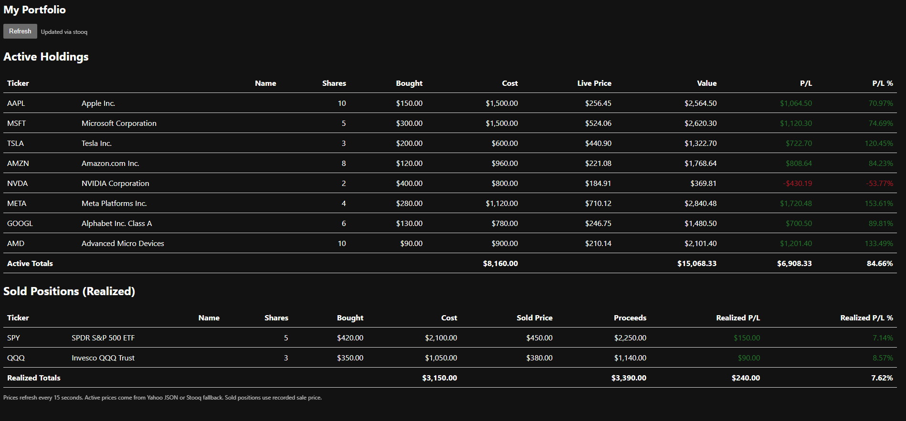

# My Stocks Portfolio Tracker

A simple real-time stock portfolio tracker that shows live prices and calculates profit/loss.

A real-time stock portfolio tracker with live price updates.

## Features

Real-time stock prices from Yahoo Finance  ## FeaturesA real-time stock portfolio tracker with live price updates.A real-time stock portfolio tracker with live price updates.

Automatic fallback to Stooq if Yahoo fails  

# My Stocks Portfolio Tracker

Simple stock portfolio tracker with live prices and profit/loss breakdown.


## 1. Features

- Live prices (Yahoo Finance JSON; Stooq fallback)
- Active holdings (unrealized cost/value)
- Sold positions (realized P/L)
- Auto refresh (default 15s)
- Command-line P/L summary (`npm run pl`)
- Private personal data via `myportfolio.json` (gitignored)
- Single configuration point (`config.js`)

## 2. Requirements

- Node.js 18+ (any recent LTS should work)

## 3. Installation

```bash
git clone https://github.com/eyadgad/my_stocks.git
cd my_stocks
npm install  
```

## 4. Running the Web App

```bash
npm start
```
Open: http://localhost:3000

## 5. Command-Line P/L Summary

```bash
npm run pl
```
Shows totals for active (cost basis) and realized (sold) positions.

### Demo File
`portfolio.json` ships with sample tickers for testing.

### Personal File
Create `myportfolio.json` in the project root:

```json
[
   { "ticker": "AAPL", "name": "Apple Inc.", "bought": 150.00, "shares": 10, "sold": -1 },
   { "ticker": "MSFT", "name": "Microsoft", "bought": 300.00, "shares": 5, "sold": 250.00 }
]
```

Field notes:
- `ticker`: symbol
- `name`: display name
- `bought`: purchase price per share
- `shares`: number of shares
- `sold`: -1 if still held; otherwise sale price per share

You may list the same ticker multiple times (separate lots).

## 6. Project Structure

```
config.js        # Chooses myportfolio.json or portfolio.json
server.js        # HTTP server + API endpoints (/api/portfolio, /api/quotes)
index.html       # UI markup
web.js           # Frontend logic (fetch + render)
scrapeYahoo.js   # Price fetch with Yahoo + Stooq fallback
computePL.js     # CLI profit/loss summary
portfolio.json   # Demo data
myportfolio.json # (create this for personal data; ignored by git)
```


---
